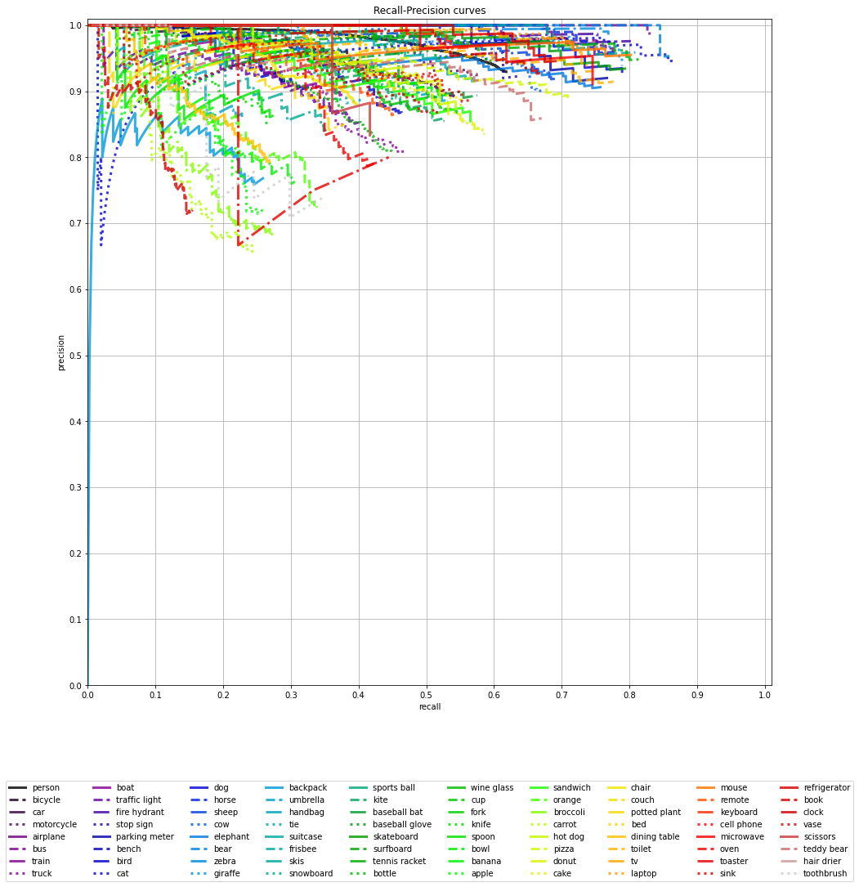
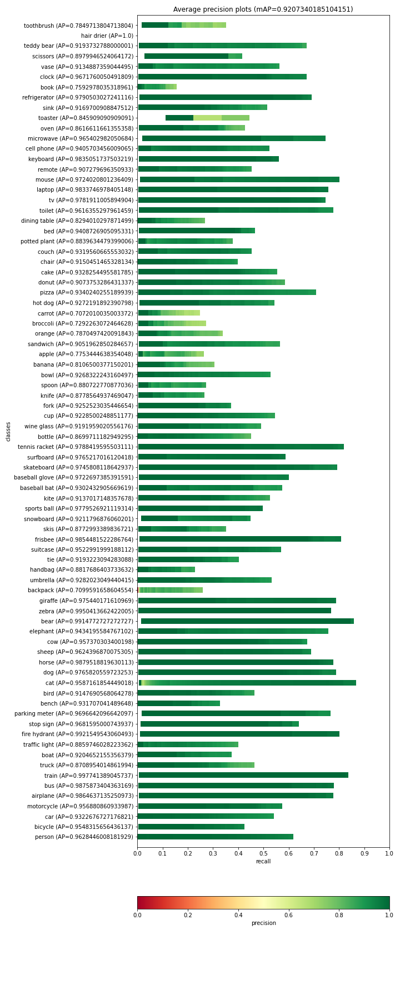
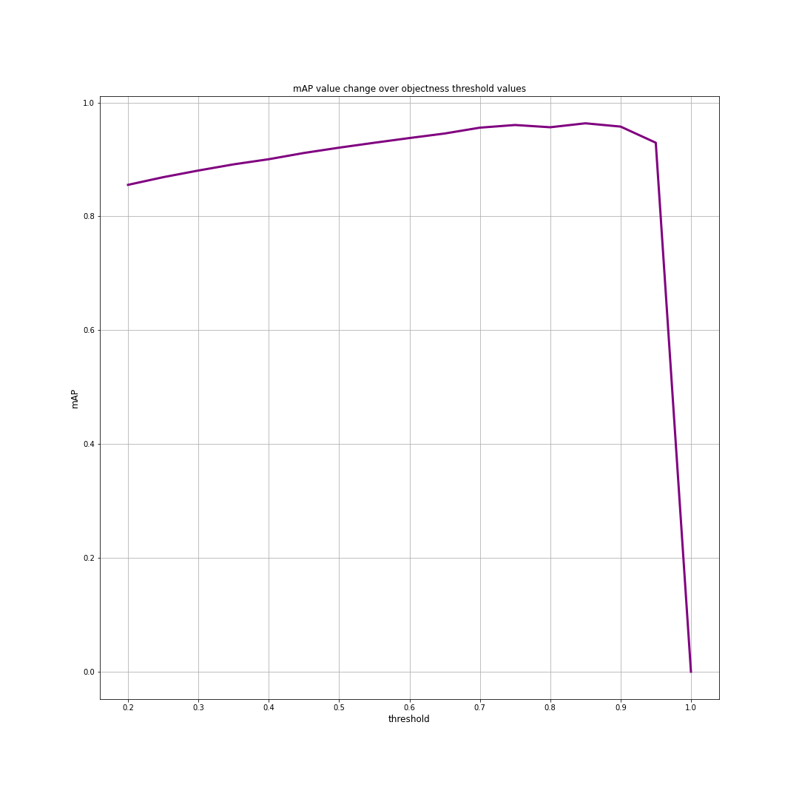
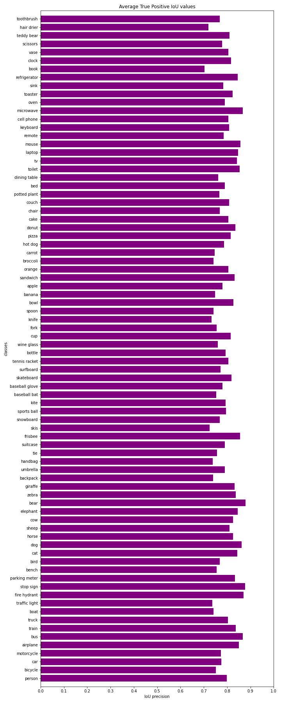
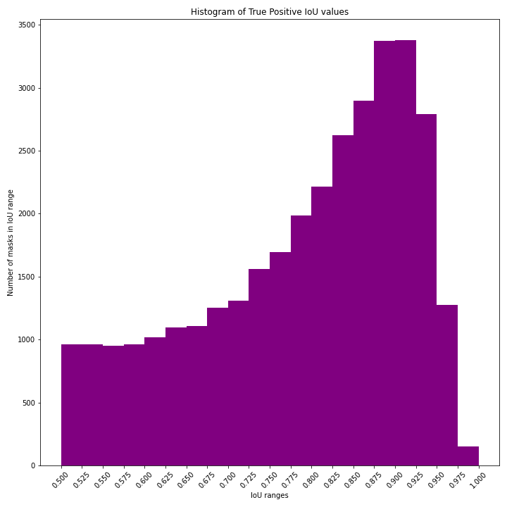

Object detection metrics
------------------------

    Per-Class Recall-Precision curves

    Per-Class precision gradients

    mAP values depending on threshold

* *Mean Average Precision* for threshold 0.5: 0.9207340185104151
* Best *Mean Average Precision* occurs at threshold 0.85  and it is: 0.963529

    Per-Class mean IoU values for correctly labeled objects

    Histogram of IoU values for correctly labeled objects